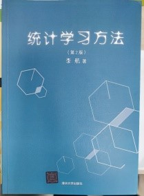

# SDUT_CV
Professor Gao_Laboratory related information

| 序号 | 图书名称 | 作者 | 出版社 | 图书照片 |
| --- | --- | --- | --- | --- |
| 1 | 深度学习算法实践 | 吴岸城 | 电子工业出版社 |  |
| 2 | 深度学习方法及应用 | [著]邓力/俞栋 [译]谢磊 | 机械工业出版社 |  |
| 3 | TensorFlow实战Google深度学习框架 | 才云科技Caicloud/郑泽宇/顾思宇 | 电子工业出版社 |  |
| 4 | TensorFlow实战 | 黄文坚/唐源 | 电子工业出版社 |  |
| 5 | 深度学习原理与TensorFlow实践 | [主编]喻俨/夏瑜[著]王琛/胡振邦/高杰 | 电子工业出版社 |  |
| 6 | 神经网络与深度学习 | 吴岸城 | 电子工业出版社 |  |
| 7 | 深度学习——Caffe之经典模型详解与实践 | 乐毅/王斌 | 电子工业出版社 |  |
| 8 | 统计学习方法 | 李航 | 清华大学出版社 |  |
| 9 | Python编程从入门到实践(第2版) | [著]埃里克·马瑟斯[译]袁国忠 | 人民邮电出版社 |  |
| 10 | Python极客项目编程 | [著]Mahesh Venkitachalam[译]王海鸥 | 人民邮电出版社 |  |
| 11 | Python编程快速上手——让繁琐工作自动化 | [著]AI Sweigart[译]王海鸥 | 人民邮电出版社 |  |
| 12 | 鸟哥的Linux私房菜基础学习篇（第四版） | 鸟哥 | 人民邮电出版社 |  |
| 13 | 机器学习 | 周志华 | 清华大学出版社 |  |
| 14 | 机器学习公式详解 | 谢文睿/秦州 | 人民邮电出版社 |  |
| 15 | Python图像处理 | [著]桑迪潘·戴伊[译]陈盈/邓军 | 人民邮电出版社 |  |
